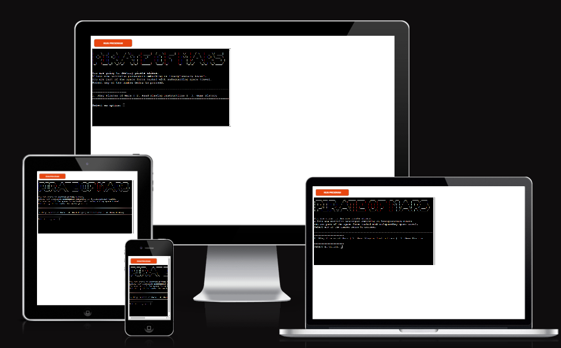

# Pirate of Mars

[View the live project here](https://mars-pirate-5cbc5f63ea79.herokuapp.com/)

## Table of contents
1. [Introduction](#Introduction)
    1. [How To Play](#How-To-Play)
2. [UX](#UX)
    1. [Ideal User Demographic](#Ideal-User-Demographic)
    2. [User Stories](#User-Stories)
    3. [Development Planes](#Development-Planes)
3. [Features](#Features) 
    1. [Features](#features)
    2. [Imagery](#Imagery)
    3. [Features to Implement in the future](#Features-to-Implement-in-the-future)
4. [Issues and Bugs](#Issues-and-Bugs)
5. [Technologies Used](#Technologies-Used)
    1. [Main Languages Used](#Main-Languages-Used)
    3. [Frameworks, Libraries & Programs Used](#Frameworks,-Libraries-&-Programs-Used)
6. [Testing](#Testing)
    1. [Testing User Stories](#Testing-User-Stories)
    2. [Manual Testing](#Manual-Testing)
    3. [Automated Testing](#Automated-Testing) 
        - [Code Validation](#Code-Validation)
    4. [User Testing](#User-Testing)
7. [Deployment](#Deployment)
    1. [Deploying on GitHub Pages](#Deploying-on-GitHub-Pages)
8. [Credits](#Credits)
    1. [Content](#Content)
    2. [Media](#Media)
    3. [Code](#Code)
9. [Acknowledgements](#Acknowledgements)
***

## Introduction
Welcome to Pirate of Mars, an exciting game where you defend space travel by eliminating alien pirates! Engage in thrilling battles as you try to locate and destroy these dangerous extraterrestrial invaders. 

For the Portfolio Project 3 - Python Essentials, the developer decided to build a Pirate Mars game. The Pirate of Mars game is a simple command-line game written in Python. The player is part of the space force and is tasked with safeguarding space travel by eliminating pirate aliens. The game provides instructions and allows the player to make guesses to kill the aliens.

### How To Play

1. Start the game by selecting option 2 from the main menu.
2. Read the game instructions and rules:
   - To start the game, press 'y' to start and 'n' to stop.
   - You can play the game 5 times, and you need to kill 3 aliens to win.
   - You kill an alien when you fire your weapon at their hiding cell.
   - The cells are numbered from 1 to 9 (10 not inclusive).
3. Once you are familiar with the instructions, return to the main menu.
4. Select option 1 to play the Pirate of Mars game.
5. Follow the prompts and make guesses to find and eliminate the alien pirates.
6. After each guess, the game will provide feedback on whether your guess was correct or not.
7. The game will keep track of your game statistics, including the time taken for each guess.
8. The game will end after the maximum number of trials is reached or when you win or lose.
9. At the end of the game, the game history and your score will be displayed.
10. To play again, you can return to the main menu and select option 1.

[Back to top ⇧](#)

## UX
### Ideal User Demographic
The ideal user for this website is:
* New user
* Current user

#### New User Goals
1. Understand the objective of the game and how to play.
2. Experience a fun and engaging space-themed game.
3. Learn the game mechanics and rules.
4. Achieve a high score by successfully killing alien pirates.

#### Current User
1. Improve gameplay strategies to increase the chances of killing aliens.
2. Beat previous high scores and achieve a perfect game.
3. Explore additional features and game modes.
4. Share the game with friends and compete for the highest scores.

### Development-Planes
To create a command-line application that allows the user to play a thrilling battle ship game. Exciting development plans for the Pirate of Mars game includes:
   - Introducing additional levels with increasing difficulty to provide more challenging gameplay
   - Implementing multiplayer functionality to allow players to compete against each other.

#### Strategy
The Pirate of Mars game is designed for players who enjoy interactive and strategic gaming experiences. The target user demographic includes:
- Age: The game appeals to a broad age range, from teenagers to adults, who have an interest in science fiction, space-themed adventures, and strategy games.
- Gaming Enthusiasts: It targets individuals who have a passion for gaming and enjoy exploring new and unique game concepts. They appreciate the challenge of solving puzzles, making strategic decisions, and achieving high scores.
- Science Fiction Fans: The game caters to science fiction enthusiasts who are captivated by the idea of space exploration, alien encounters, and intergalactic battles. They will find delight in the immersive storyline and alien pirate concept.
- Casual Gamers: The Pirate of Mars game also welcomes casual gamers who seek entertainment and relaxation through light-hearted gameplay. 

#### Scope
The scope planning phase involves translating the established goals from the strategy plane into specific requirements. Taking into account the information gathered in the strategy plane, the required features have been categorized into the following two groups:
- Content Requirements:
   - Game Storyline: The game will revolve around defending space travel by eliminating alien.
   - Game Instructions: Clear instructions will be provided on how to play the game, including starting and stopping the game, the objective, the number of trials, and how to eliminate aliens.
   - Alien Pirates: The game will feature different alien pirates as enemies, each with its own hiding cell.
   - Visuals and Graphics: The game will have a text-based interface with appropriate visual cues and ASCII art for a visually appealing experience.

- Functionality Requirements:  
   - Main Menu: The game will have a main menu with options to start the game, read instructions, view game history, and exit the game.
   - Gameplay: Players will be able to make guesses to locate and eliminate alien pirates by entering the corresponding cell number.
   - Validation: The game will validate user input and handle incorrect inputs, providing appropriate error messages.
   - Score Tracking: The game will keep track of the player's score, including the number of aliens eliminated.

#### Structure
The project will be deployed to a Heroku terminal.  

## Features
   -Displays a game title using the pyfiglet library. 
   - Provides game instructions for the player.
   - Allows the player to make guesses and records game statistics.
   - Ends the game after a certain number of trials or when the player wins or loses.
   - Offers an option to return to the main menu.

### Imagery

### Features to Implement in the future
Potential features that could be implemented into the "Pirate of Mars" game in the future:
- Multiple Difficulty Levels: Introduce different difficulty levels to cater to players of varying skill levels. Each level could have its own set of challenges and gameplay mechanics.
- Online Multiplayer: Implement an online multiplayer mode where players can compete against each other or collaborate to defeat waves of aliens. This could add a competitive or cooperative element to the game.

[Back to top ⇧](#)

## Issues and Bugs 
The developer ran into several issues during the development of the website, with the noteworthy ones listed below, along with solutions or ideas to implement in the future.

- Solved Bugs
    - A bug I came across was the players error message for when placing a ship which overlaps over existing ships or doesn’t fit the board was being printed when it was the computers turn to place its ships. I fixed it by using a for loop in the players turn of the place ship function to print the message therefore no message would be printed if the computers ship overlapped or did not fit the board. 

    - A bug was found when replaying the game the board was not clearing the ships from the previous game. I fixed this by adding a reset funtion this clears the board so the game can be played again without exiting and restarting the app.

- Remaining Bugs
    - No bugs remaining.

[Back to top ⇧](#)

## Technologies Used
### Main Languages Used
- [Python](https://en.wikipedia.org/wiki/Python_(programming_language) "Link to Python Wiki")

### Frameworks, Libraries & Programs Used
- [GitPod](https://gitpod.io/ "Link to GitPod homepage")
    - GitPod was used for writing code, committing, and then pushing to GitHub.
- [GitHub](https://github.com/ "Link to GitHub")
- [Pyfiglet](https://pypi.org/project/pyfiglet/ "Link to Pyfiglet homepage")
    - Lucid was used to create a flowchart of information, making the logic of the game easily understood.
- [Am I Responsive?](http://ami.responsivedesign.is/# "Link to Am I Responsive Homepage")

[Back to top ⇧](#)

## Testing

Due to the nature of the project, testing has been implemented throughout the entire project mainly debugging through running the program in the terminal as well as debugging using the python debugger. This is shown by commits of refactoring code.
Sections of code where developed before implementation to make sure it worked and also where run through the PEP8 validator.
Tested with invalid inputs: Such as using Type Errors and Value Errors, string instead of integers, out of bound inputs, same input twice.
Tested in both Gitpod terminal and CI Heroku terminal.
Limit testing has been conducted by myself, users and peers on slack through the peer-code-review channel, there is currently no reported issues that cause the game to break.

## Manual Testing
Manual testing has been performed on the Pirate of Mars code to ensure its functionality and identify any potential issues. The following scenarios were tested:
   - Game Start: The game was started by selecting the appropriate option from the main menu. The game should initialize without any errors.
   - Game Instructions: The game instructions were accessed from the main menu. The instructions should be displayed clearly and provide a clear understanding of how to play the game.
   - Valid Guess: A valid guess was made during gameplay. The game should correctly evaluate the guess and provide appropriate feedback.
   - Invalid Guess: An invalid guess, such as a non-numeric input, was made during gameplay. The game should handle the invalid input gracefully and prompt the player to enter a valid guess.
   -Game Completion: The game was played multiple times until the maximum number of trials was reached. The game should track the player's score and determine the outcome correctly.
   - Game Completion: The game was played multiple times until the maximum number of trials was reached. The game should track the player's score and determine the outcome correctly. 
   - Game History: The game history option was accessed from the main menu. The game history should be displayed accurately, showcasing the relevant details of each game played.
   - Return to Main Menu: After completing a game or accessing game history, the option to return to the main menu was selected. The game should navigate back to the main menu successfully.

## Automated Testing

### Code Validation
The [PEP8 Online Checker](https://extendsclass.com/python-tester.html/) service was used to validate the code written in the run.py file.

**Results:**

run.py Validation results

## User testing 

I requested my wife and two friends to conduct the following test:
   - Gameplay Experience: Players were asked to play the game and provide feedback on their overall gameplay experience. This included assessing the game's controls, responsiveness, and intuitiveness. Feedback was collected on the clarity of instructions, the flow of the game, and the engagement level.
   - Functionality Testing: Players were tasked with performing specific actions within the game, such as starting a new game, making guesses, and navigating through different sections. The functionality of these features was assessed, and any issues encountered were noted.
   - Error Handling: Players intentionally entered invalid inputs to test how the game handled such situations. The effectiveness of error messages and clear instructions for corrective actions were evaluated.

## Deployment
### GitHub
This project utilized GitPod for development, with commits and pushes to GitHub performed through the GitPod terminal. To create a GitHub repository, follow these steps:
1. Sign in to your GitHub account.
2. On the top left of the home screen, click the 'New' button.
3. From the dropdown menu under 'Repository template', select the desired template.
4. Provide a repository name and description for your project.
5. Choose whether to make the repository public or private.
6. Optionally, you can add a README file, a .gitignore file, or select a license.
7. Click the 'Create Repository' button to create your repository.

### GitHub Forking and Cloning
To fork and clone the project, follow these steps:

1. Forking a GitHub repository:

Forking a project allows you to propose changes to the original repository. It is recommended to keep your fork synced with the upstream repository. To accomplish this, use Git on the command line.
   - Navigate to the repository you want to fork.
   - In the top-right corner of the page, click the "Fork" button.

2. Cloning your forked repository:

   - Go to your forked repository.
   - Above the list of files, click on the "Code" button.
   - To clone the repository using HTTPS:
      - Click on the clipboard icon next to "Clone with HTTPS".
   - To clone the repository using an SSH key:
      - Click on "Use SSH" and then click on the clipboard icon.
   - To clone the repository using GitHub CLI:
      - Click on "Use GitHub CLI" and then click on the clipboard icon.
   - Open Git Bash.
   - Navigate to the directory where you want to clone the repository.
   - Type git clone and paste the URL you copied earlier. It should resemble:
git clone https://hostname/YOUR-USERNAME/repo-name
   - Press Enter, and the repository will be cloned to your local machine.

### Deploying on Heroku
To deploy this project to Heroku from its GitHub repository, the following steps were taken:

1. In your repository, type "pip freeze > requirements.txt" to create the list of dependencies to the requirements.txt file. Save, commit and push your changes to GitHub.

2. Create an account with [Heroku](https://www.heroku.com/ "Link to Heroku site"), selecting Python as the 'Primary development language'.

3. Go to your emails and click the link to verify your email address. The link will bring you to a page where you can create a password. Create a password and log in.

4. On the dashboard, click the 'create new app' button. Enter a unique name for your app and select your region. Click 'Create App'.

5. Go to the settings tab and click 'Reveal Config Vars'. Enter PORT as the KEY value and 8000 as the VALUE value.

6. Click 'Add Buildpack' and select 'Python' and 'Nodejs'. Python must be on the top of the list. Click and drag the buildpacks to the correct positions if needed.

7. Go to the deploy tab and, under 'Deployment method', click 'GitHub' and then 'Connect to GitHub'.

8. In 'Connect to GitHub', search for the repository you wish to use, then click 'Connect'.

9. If you 'Enable Automatic Deploys', Heroku will rebuild the app every time you push a change to GitHub. You can also choose to manually deploy using the 'Deploy Branch' option. Heroku will build the app and when it is finished, click the 'View' button to open the terminal.

## Credits 

The webpage [GitHub Docs - Fork a repo](https://docs.github.com/en/github-ae@latest/get-started/quickstart/fork-a-repo "Link to a GitHub Docs article on cloning and forking a repository") was used to get instructions on forking and cloning a repository. This information was used in the Deployment section of the README file.

### Code 
The developer referred to various websites to enhance his understanding of the code being implemented. Codes from W3School, Developer Mozilla, amd Code with Moss were adopted for use in this project. The following websites were frequently consulted:
- [Stack Overflow](https://stackoverflow.com/ "Link to Stack Overflow page")
- [W3Schools](https://www.w3schools.com/ "Link to W3Schools page")
- [Developer Mozilla](https://developer.mozilla.org/en-US/docs/Web/HTML/Element/input "link to mozilla website")
- [Heroku](https://fruit-hunter.herokuapp.com/ "Link to another students game on heroku")

[Back to top ⇧](#)

## Acknowledgements

- I would like to thank my family for their valued opinions and critic during the process of design and development.
- I would like to thank my tutor Seun, for their invaluable help and guidance throughout the process encouraging me to push myself and make a better project.
- Lastly, I would like to extend my deepest gratitude to the amazing people in Slack who helped me rigorously test every aspect of my site.

[Back to top ⇧](#)